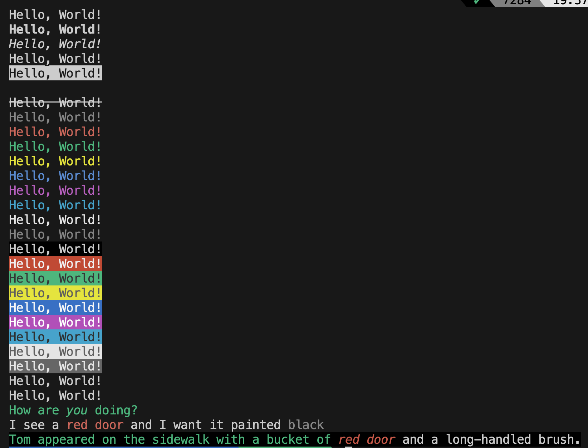

# Colorust [WIP]

Colorust is colors library for terminal output formatting with ANSI colors writting in RUST, WASM & JS

## Build

Build the rust lib.rs using cargo by typing at the root

> cargo build

Then build the wasm pkg for it using command

> wasm-pack build --target nodejs

## Test

Run the nodejs app to test it out

> node app.js

## Demo

{width:50%}

## Credits

This library is merely a RUST implementation of (https://github.com/alexeyraspopov/picocolors) and not written from scratch
